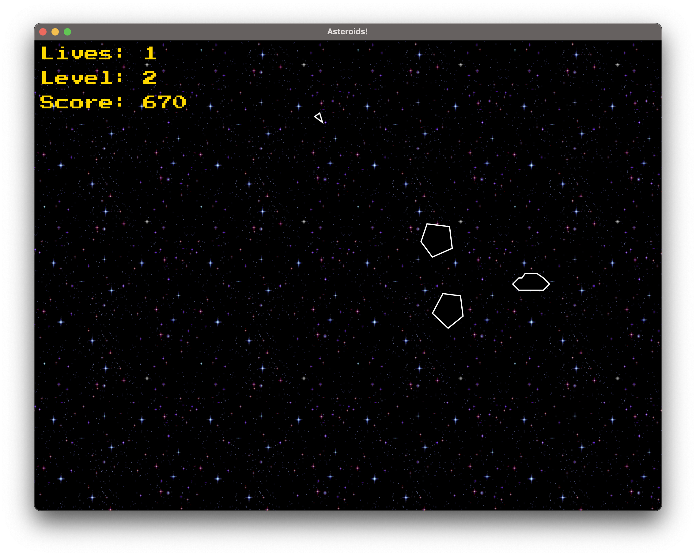

# Asteroids
This objective of this project is to create a game which emulates Asteroids, the classic arcade game. The players ship flys through space destoying asteroids and the occasional alien ship. As the player advances through each levels the difficulty of the game increases, with more sophisticated enemies to destoy.

https://github.com/finbarallan/Asteroids/assets/116646659/ff9111d2-be5b-4667-9bac-8d6b28cd10a6

## Gameplay
Launcing the application displys the main menu where players can begin the game, view high scores, read the rules, and learn the controls.

From the game screen players can move their ship, fire bullets, and hyperspace jump to a random location on the screen.

Players can shoot larger asteroids, causing them to split. At random intervals alien ships will appear and try to shoot the player.

As the player destroys asteroids and alien ships they will score points, earning an extra life for every 1000 points.

The player enters a 3-second period of invulnerability after respawning to ensure they are given a chance to escape any immediate danger. 

The game over screeen appears when the player runs out of lives, saving their name and score to the leaderboard and returning them to the main menu to play again.

## Languages & Frameworks

